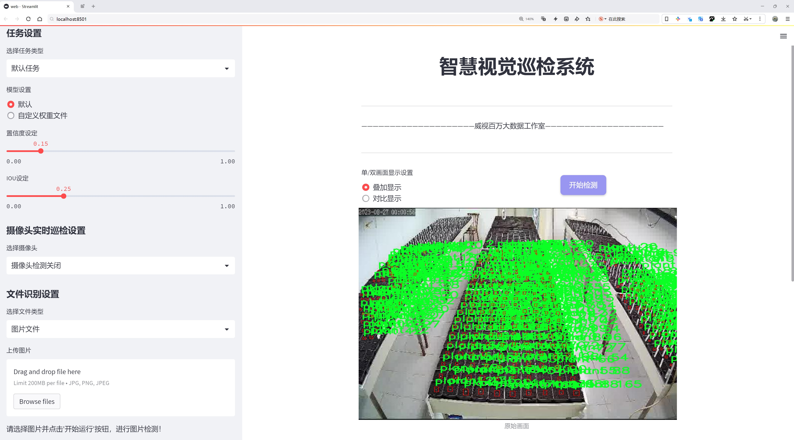
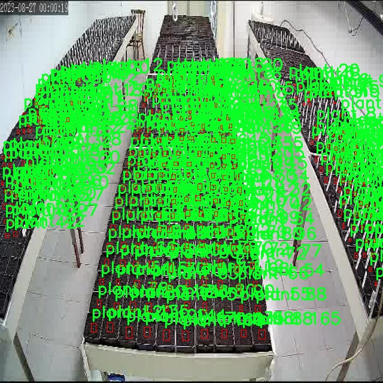
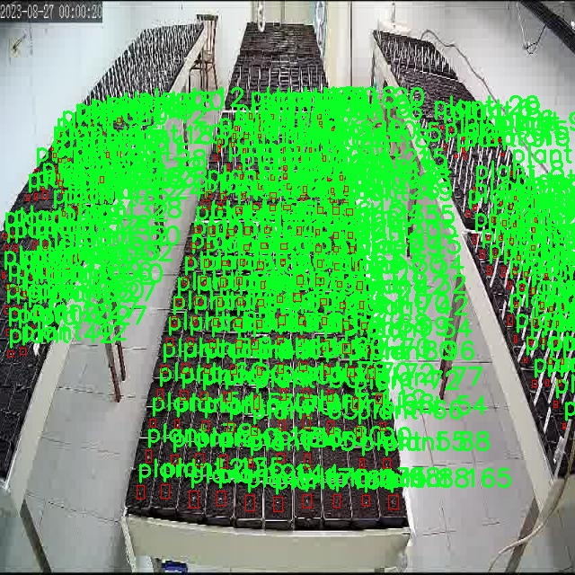

# 植物检测与分类检测系统源码分享
 # [一条龙教学YOLOV8标注好的数据集一键训练_70+全套改进创新点发刊_Web前端展示]

### 1.研究背景与意义

项目参考[AAAI Association for the Advancement of Artificial Intelligence](https://gitee.com/qunmasj/projects)

项目来源[AACV Association for the Advancement of Computer Vision](https://kdocs.cn/l/cszuIiCKVNis)

研究背景与意义

随着全球人口的不断增长和城市化进程的加快，植物的保护与管理变得愈发重要。植物不仅是生态系统的重要组成部分，也是人类生存和发展的基础。为了有效地监测和管理植物资源，科学家们逐渐认识到计算机视觉技术在植物检测与分类中的潜力。近年来，深度学习技术的迅猛发展，尤其是目标检测算法的不断演进，为植物识别和分类提供了新的解决方案。其中，YOLO（You Only Look Once）系列算法因其高效性和实时性而备受关注，尤其是最新版本YOLOv8在目标检测领域展现出了卓越的性能。

本研究旨在基于改进的YOLOv8算法，构建一个高效的植物检测与分类系统。该系统将应用于“Plants Rythmes”数据集，该数据集包含2800张图像，涵盖了植物和其他植物类的两个主要类别。通过对这一数据集的深入分析与处理，研究将重点探讨如何提高植物检测的准确性和效率，以满足实际应用中的需求。

在植物检测与分类的研究中，数据集的质量和多样性至关重要。虽然“Plants Rythmes”数据集的图像数量相对较少，但其涵盖的类别具有代表性，能够为模型的训练提供基本的样本。通过对该数据集的扩展和增强，研究将探索如何在有限的数据条件下提升模型的泛化能力。此外，改进YOLOv8算法的结构和参数设置，将有助于提高模型在植物检测中的表现，尤其是在复杂背景和不同光照条件下的鲁棒性。

本研究的意义不仅在于推动植物检测技术的发展，更在于为生态保护和植物资源管理提供实用工具。通过实现高效的植物检测与分类系统，相关部门可以更好地监测植物生长状况，及时发现病虫害，进而采取相应的保护措施。此外，该系统还可以为农业生产提供数据支持，帮助农民优化种植策略，提高作物产量。

在学术层面，本研究将为植物识别领域的深度学习应用提供新的视角和方法。通过对YOLOv8算法的改进与优化，研究将丰富目标检测技术在生态学和植物学中的应用案例，推动相关领域的交叉研究。同时，研究结果也将为后续的相关研究提供基础数据和理论支持，促进植物检测技术的进一步发展。

综上所述，基于改进YOLOv8的植物检测与分类系统的研究，不仅具有重要的理论价值和应用前景，也为生态保护和农业发展提供了新的思路和方法。通过这一研究，期望能够为植物资源的可持续管理贡献一份力量，同时推动计算机视觉技术在生物科学领域的应用与发展。

### 2.图片演示




##### 注意：由于此博客编辑较早，上面“2.图片演示”和“3.视频演示”展示的系统图片或者视频可能为老版本，新版本在老版本的基础上升级如下：（实际效果以升级的新版本为准）

  （1）适配了YOLOV8的“目标检测”模型和“实例分割”模型，通过加载相应的权重（.pt）文件即可自适应加载模型。

  （2）支持“图片识别”、“视频识别”、“摄像头实时识别”三种识别模式。

  （3）支持“图片识别”、“视频识别”、“摄像头实时识别”三种识别结果保存导出，解决手动导出（容易卡顿出现爆内存）存在的问题，识别完自动保存结果并导出到tempDir中。

  （4）支持Web前端系统中的标题、背景图等自定义修改，后面提供修改教程。

  另外本项目提供训练的数据集和训练教程,暂不提供权重文件（best.pt）,需要您按照教程进行训练后实现图片演示和Web前端界面演示的效果。

### 3.视频演示

[3.1 视频演示](https://www.bilibili.com/video/BV1JBsQeKEUi/)

### 4.数据集信息展示

##### 4.1 本项目数据集详细数据（类别数＆类别名）

nc: 2
names: ['plant', 'plants']


##### 4.2 本项目数据集信息介绍

数据集信息展示

在本研究中，我们使用了名为“Plants Rythmes”的数据集，以支持对植物检测与分类系统的改进，特别是针对YOLOv8模型的训练。该数据集专注于植物的视觉特征，旨在为计算机视觉领域提供丰富的样本和标注，以提升模型在植物识别任务中的准确性和鲁棒性。数据集的类别数量为2，具体类别包括“plant”和“plants”，这两个类别的设置旨在涵盖植物的多样性和复杂性，确保模型能够在不同的场景中有效识别和分类。

“Plants Rythmes”数据集的构建过程考虑了多种植物的形态特征、颜色变化和生长环境等因素，确保数据的多样性和代表性。数据集中包含的图像来源于不同的生态环境，涵盖了从室内植物到户外植物的多种场景。这种多样性不仅增强了数据集的实用性，也为模型的训练提供了丰富的上下文信息，使其能够更好地适应实际应用中的各种情况。

在数据集的标注过程中，采用了精确的边界框标注技术，确保每个植物实例都被准确地框定。这种标注方式不仅提高了模型在检测任务中的性能，也为后续的分类任务奠定了基础。通过对每个图像中植物的细致标注，研究者能够更深入地分析植物的特征，进而优化YOLOv8模型的参数设置和结构设计。

此外，数据集还考虑到了植物在不同生长阶段和不同环境条件下的表现。例如，某些植物在阳光充足的环境中与在阴暗环境中的表现可能截然不同，这种变化被充分考虑并体现在数据集中。这种环境适应性使得训练出的模型不仅能够识别植物的种类，还能对其生长状态进行初步判断，为实际应用提供了更为全面的信息。

在训练过程中，数据集的有效利用将直接影响到模型的性能表现。通过精心设计的训练方案，结合“Plants Rythmes”数据集的多样性，研究者能够在不同的训练阶段不断调整模型参数，以实现最佳的检测和分类效果。同时，数据集的规模和质量也为模型的泛化能力提供了保障，使其能够在未见过的样本上依然保持较高的识别率。

总之，“Plants Rythmes”数据集不仅为本研究提供了丰富的训练样本，也为改进YOLOv8模型的植物检测与分类系统奠定了坚实的基础。通过对该数据集的深入分析和有效利用，我们期望能够实现更高效、更准确的植物识别系统，为植物科学研究、农业监测以及生态保护等领域提供有力的技术支持。







### 5.全套项目环境部署视频教程（零基础手把手教学）

[5.1 环境部署教程链接（零基础手把手教学）](https://www.ixigua.com/7404473917358506534?logTag=c807d0cbc21c0ef59de5)


[5.2 安装Python虚拟环境创建和依赖库安装视频教程链接（零基础手把手教学）](https://www.ixigua.com/7404474678003106304?logTag=1f1041108cd1f708b01a)

### 6.手把手YOLOV8训练视频教程（零基础小白有手就能学会）

[6.1 手把手YOLOV8训练视频教程（零基础小白有手就能学会）](https://www.ixigua.com/7404477157818401292?logTag=d31a2dfd1983c9668658)

### 7.70+种全套YOLOV8创新点代码加载调参视频教程（一键加载写好的改进模型的配置文件）

[7.1 70+种全套YOLOV8创新点代码加载调参视频教程（一键加载写好的改进模型的配置文件）](https://www.ixigua.com/7404478314661806627?logTag=29066f8288e3f4eea3a4)

### 8.70+种全套YOLOV8创新点原理讲解（非科班也可以轻松写刊发刊，V10版本正在科研待更新）

由于篇幅限制，每个创新点的具体原理讲解就不一一展开，具体见下列网址中的创新点对应子项目的技术原理博客网址【Blog】：


[8.1 70+种全套YOLOV8创新点原理讲解链接](https://gitee.com/qunmasj/good)

### 9.系统功能展示（检测对象为举例，实际内容以本项目数据集为准）

图9.1.系统支持检测结果表格显示

  图9.2.系统支持置信度和IOU阈值手动调节

  图9.3.系统支持自定义加载权重文件best.pt(需要你通过步骤5中训练获得)

  图9.4.系统支持摄像头实时识别

  图9.5.系统支持图片识别

  图9.6.系统支持视频识别

  图9.7.系统支持识别结果文件自动保存

  图9.8.系统支持Excel导出检测结果数据


### 10.原始YOLOV8算法原理

原始YOLOv8算法原理

YOLOv8算法是由Ultralytics团队在YOLOv5的基础上发展而来的，旨在提升目标检测的精度和速度。该算法在2023年1月正式发布，结合了过去两年半中在实际应用中获得的各种改进。YOLOv8不仅继承了YOLO系列的核心思想，还在多个方面进行了创新和优化，使其在目标检测领域表现出色。

首先，YOLOv8在数据预处理方面进行了细致的考量。虽然Mosaic数据增强技术在提升模型鲁棒性和泛化能力方面表现良好，但其在一定程度上可能会破坏数据的真实分布，导致模型学习到不良信息。因此，YOLOv8在训练的最后10个epoch中停止使用Mosaic增强，以确保模型能够更好地捕捉真实数据的特征。这一改进体现了YOLOv8团队对数据质量的重视，旨在提升模型的学习效果。

在网络结构上，YOLOv8的主干网络与YOLOv5相似，但进行了重要的调整。C3模块被替换为C2f模块，后者在设计上引入了YOLOv7中的ELAN思想，增加了更多的跳层连接。这种结构的变化使得梯度流信息更加丰富，有助于模型在训练过程中更有效地传递信息。同时，C2f模块的轻量化设计确保了模型的计算效率，减少了执行时间。此外，YOLOv8依然保留了快速空间金字塔池化（SPPF）模块，以增强特征提取能力。

在颈部网络（Neck）中，YOLOv8同样将所有的C3模块更改为C2f模块，并删除了两处上采样之前的卷积连接层。这一改动进一步简化了网络结构，提高了特征融合的效率。YOLOv8采用了FPN（特征金字塔网络）和PAN（路径聚合网络）结构，确保来自不同尺度的特征图能够有效融合，从而提升对多尺度目标的检测能力。

在头部网络（Head）中，YOLOv8引入了解耦头的概念，采用两条并行的分支分别提取类别和位置特征。这种设计使得分类任务和定位任务能够独立优化，进而提高了模型的收敛速度和预测精度。具体而言，分类任务更关注特征图中提取到的特征与已有类别的相似性，而定位任务则侧重于边界框与真实框之间的位置关系。通过这种方式，YOLOv8在目标检测的精度和速度上都取得了显著提升。

值得注意的是，YOLOv8采用了无锚框结构，直接预测目标的中心，并通过任务对齐学习（TAL）来区分正负样本。这一策略通过引入分类分数和IOU的高次幂乘积作为衡量任务对齐程度的指标，确保模型在分类和定位任务中都能取得良好的表现。通过对正负样本的精细处理，YOLOv8能够更好地平衡分类和定位的损失函数，从而提升整体检测性能。

在损失函数方面，YOLOv8引入了Varifocal Loss（VFL）和CIoU Loss与DFL Loss的组合形式。VFL通过不对称参数对正负样本进行加权，使得高质量的正样本对损失的贡献更大，而负样本的影响则被有效降低。这种策略使得模型在训练过程中能够更加专注于高质量样本，从而提升了AP（平均精度）指标。

YOLOv8在检测结果上也表现出色，尤其是在COCO数据集上的表现尤为突出。通过对比不同尺寸的模型，YOLOv8在保持较小参数量的同时，取得了更高的精度和更快的推理速度。这一特性使得YOLOv8在实时性和准确性之间找到了良好的平衡，适合于各种实际应用场景，尤其是在需要快速响应的目标检测任务中。

综合来看，YOLOv8算法在多个方面进行了创新和优化，从数据预处理到网络结构，再到损失函数的设计，都体现了对目标检测任务的深刻理解和实践经验的积累。通过这些改进，YOLOv8不仅在精度和速度上超越了前代模型，还为未来的目标检测研究提供了新的思路和方向。无论是在学术研究还是实际应用中，YOLOv8都展现出了广泛的应用潜力和研究价值。


### 11.项目核心源码讲解（再也不用担心看不懂代码逻辑）

#### 11.1 70+种YOLOv8算法改进源码大全和调试加载训练教程（非必要）\ultralytics\nn\extra_modules\ops_dcnv3\functions\dcnv3_func.py

以下是对代码中最核心部分的提取和详细中文注释：

```python
import torch
import torch.nn.functional as F
from torch.autograd import Function
from torch.cuda.amp import custom_bwd, custom_fwd

class DCNv3Function(Function):
    @staticmethod
    @custom_fwd
    def forward(ctx, input, offset, mask, kernel_h, kernel_w, stride_h, stride_w, pad_h, pad_w, dilation_h, dilation_w, group, group_channels, offset_scale, im2col_step, remove_center):
        # 保存卷积参数到上下文中，以便在反向传播时使用
        ctx.kernel_h = kernel_h
        ctx.kernel_w = kernel_w
        ctx.stride_h = stride_h
        ctx.stride_w = stride_w
        ctx.pad_h = pad_h
        ctx.pad_w = pad_w
        ctx.dilation_h = dilation_h
        ctx.dilation_w = dilation_w
        ctx.group = group
        ctx.group_channels = group_channels
        ctx.offset_scale = offset_scale
        ctx.im2col_step = im2col_step
        ctx.remove_center = remove_center

        # 准备参数并调用DCNv3的前向计算
        args = [input, offset, mask, kernel_h, kernel_w, stride_h, stride_w, pad_h, pad_w, dilation_h, dilation_w, group, group_channels, offset_scale, ctx.im2col_step]
        if remove_center:
            args.append(remove_center)

        output = DCNv3.dcnv3_forward(*args)  # 调用DCNv3的前向函数
        ctx.save_for_backward(input, offset, mask)  # 保存输入以便反向传播使用

        return output

    @staticmethod
    @custom_bwd
    def backward(ctx, grad_output):
        # 从上下文中恢复保存的张量
        input, offset, mask = ctx.saved_tensors

        # 准备反向传播的参数
        args = [input, offset, mask, ctx.kernel_h, ctx.kernel_w, ctx.stride_h, ctx.stride_w, ctx.pad_h, ctx.pad_w, ctx.dilation_h, ctx.dilation_w, ctx.group, ctx.group_channels, ctx.offset_scale, grad_output.contiguous(), ctx.im2col_step]
        if ctx.remove_center:
            args.append(ctx.remove_center)

        # 调用DCNv3的反向计算
        grad_input, grad_offset, grad_mask = DCNv3.dcnv3_backward(*args)

        return grad_input, grad_offset, grad_mask, None, None, None, None, None, None, None, None, None, None, None, None, None

def dcnv3_core_pytorch(input, offset, mask, kernel_h, kernel_w, stride_h, stride_w, pad_h, pad_w, dilation_h, dilation_w, group, group_channels, offset_scale, remove_center):
    # 对输入进行填充
    input = F.pad(input, [0, 0, pad_h, pad_h, pad_w, pad_w])
    N_, H_in, W_in, _ = input.shape  # 获取输入的形状
    _, H_out, W_out, _ = offset.shape  # 获取偏移量的形状

    # 计算参考点和采样网格
    ref = _get_reference_points(input.shape, input.device, kernel_h, kernel_w, dilation_h, dilation_w, pad_h, pad_w, stride_h, stride_w)
    grid = _generate_dilation_grids(input.shape, kernel_h, kernel_w, dilation_h, dilation_w, group, input.device)

    # 计算采样位置
    sampling_locations = (ref + grid * offset_scale).repeat(N_, 1, 1, 1, 1)
    if remove_center:
        sampling_locations = remove_center_sampling_locations(sampling_locations, kernel_w=kernel_w, kernel_h=kernel_h)
    sampling_locations = sampling_locations.flatten(3, 4)

    # 使用grid_sample进行采样
    sampling_input_ = F.grid_sample(input.view(N_, H_in * W_in, group * group_channels).transpose(1, 2).reshape(N_ * group, group_channels, H_in, W_in), sampling_locations, mode='bilinear', padding_mode='zeros', align_corners=False)

    # 计算输出
    mask = mask.view(N_, H_out * W_out, group, -1).transpose(1, 2).reshape(N_ * group, 1, H_out * W_out, -1)
    output = (sampling_input_ * mask).sum(-1).view(N_, group * group_channels, H_out * W_out)

    return output.transpose(1, 2).reshape(N_, H_out, W_out, -1).contiguous()
```

### 代码核心部分分析：
1. **DCNv3Function**:
   - 该类实现了自定义的前向和反向传播函数，利用了PyTorch的`Function`类。
   - `forward`方法负责执行前向计算，保存必要的参数以供反向传播使用。
   - `backward`方法实现了反向传播，计算输入、偏移和掩码的梯度。

2. **dcnv3_core_pytorch**:
   - 该函数实现了DCNv3的核心逻辑，包括输入的填充、参考点和采样网格的计算、采样位置的生成，以及最终的输出计算。
   - 使用`F.grid_sample`进行双线性插值采样。

3. **辅助函数**:
   - `_get_reference_points`和`_generate_dilation_grids`等函数用于计算参考点和采样网格，确保在不同的卷积参数下正确生成采样位置。

### 总结：
以上代码实现了DCNv3（Deformable Convolutional Networks v3）的前向和反向传播功能，核心在于自定义的`Function`类和`dcnv3_core_pytorch`函数的实现，结合了PyTorch的自动求导机制和自定义操作。

这个文件 `dcnv3_func.py` 是一个实现了 DCNv3（Deformable Convolutional Networks v3）功能的 PyTorch 自定义操作的代码。DCNv3 是一种改进的可变形卷积方法，旨在增强卷积神经网络在处理形状变化和复杂物体时的能力。

文件开头包含版权声明和导入必要的库。使用了 `torch` 和 `torch.nn.functional`，以及一些 PyTorch 的自动求导功能。特别地，使用了 `custom_fwd` 和 `custom_bwd` 装饰器来定义前向和反向传播的自定义操作。

`DCNv3Function` 类继承自 `Function`，并实现了前向和反向传播的逻辑。在前向传播中，首先保存了一些参数，然后调用了 DCNv3 的前向函数来计算输出，并将输入、偏移量和掩码保存以供反向传播使用。反向传播中，使用保存的张量和之前的参数来计算梯度。

此外，文件中还定义了一些辅助函数。`_get_reference_points` 函数用于计算参考点，这些点在可变形卷积中用于确定卷积核的位置。`_generate_dilation_grids` 函数生成膨胀网格，用于在卷积过程中对输入进行采样。`remove_center_sampling_locations` 函数则用于去除中心采样位置，以便在某些情况下优化计算。

`dcnv3_core_pytorch` 函数是 DCNv3 的核心实现，负责处理输入、偏移量和掩码，并根据卷积核的参数进行相应的计算。它首先对输入进行填充，然后计算参考点和采样网格，最后通过 `F.grid_sample` 函数对输入进行采样，并结合掩码生成最终输出。

总的来说，这个文件实现了 DCNv3 的前向和反向传播逻辑，并提供了一些辅助函数来支持可变形卷积的计算。通过这些自定义操作，用户可以在 PyTorch 中方便地使用 DCNv3 功能，从而提高模型在处理复杂形状时的表现。

#### 11.2 ui.py

```python
import sys
import subprocess

def run_script(script_path):
    """
    使用当前 Python 环境运行指定的脚本。

    Args:
        script_path (str): 要运行的脚本路径

    Returns:
        None
    """
    # 获取当前 Python 解释器的路径
    python_path = sys.executable

    # 构建运行命令，使用 streamlit 运行指定的脚本
    command = f'"{python_path}" -m streamlit run "{script_path}"'

    # 执行命令
    result = subprocess.run(command, shell=True)
    # 检查命令执行结果，如果返回码不为0，表示出错
    if result.returncode != 0:
        print("脚本运行出错。")

# 主程序入口
if __name__ == "__main__":
    # 指定要运行的脚本路径
    script_path = "web.py"  # 这里可以替换为实际的脚本路径

    # 调用函数运行脚本
    run_script(script_path)
```

### 代码核心部分注释：
1. **导入模块**：
   - `sys`：用于获取当前 Python 解释器的路径。
   - `subprocess`：用于执行外部命令。

2. **`run_script` 函数**：
   - 接收一个参数 `script_path`，表示要运行的 Python 脚本的路径。
   - 使用 `sys.executable` 获取当前 Python 解释器的路径。
   - 构建命令字符串，使用 `streamlit` 模块运行指定的脚本。
   - 使用 `subprocess.run` 执行构建的命令，并检查返回码以判断脚本是否成功运行。

3. **主程序入口**：
   - 当脚本作为主程序运行时，指定要运行的脚本路径，并调用 `run_script` 函数执行该脚本。

这个程序文件名为 `ui.py`，其主要功能是通过当前的 Python 环境运行一个指定的脚本，具体是一个名为 `web.py` 的文件。程序首先导入了必要的模块，包括 `sys`、`os` 和 `subprocess`，以及一个自定义的 `abs_path` 函数，用于获取文件的绝对路径。

在 `run_script` 函数中，首先获取当前 Python 解释器的路径，这样可以确保使用正确的 Python 环境来运行脚本。接着，构建一个命令字符串，这个命令使用 `streamlit` 模块来运行指定的脚本。`streamlit` 是一个用于构建数据应用的库，通常用于快速开发 Web 应用。

然后，使用 `subprocess.run` 方法执行构建好的命令。这个方法会在新的 shell 中运行命令，并等待其完成。如果脚本运行过程中出现错误，返回的状态码将不为零，此时程序会打印出“脚本运行出错”的提示信息。

在文件的最后部分，使用 `if __name__ == "__main__":` 语句来确保当这个文件作为主程序运行时，以下代码才会被执行。这里指定了要运行的脚本路径 `web.py`，并调用 `run_script` 函数来执行这个脚本。

总体来说，这个程序的主要目的是提供一个简单的接口，通过命令行运行一个 Streamlit 应用，并处理可能出现的错误。

#### 11.3 code\ultralytics\data\explorer\__init__.py

以下是代码中最核心的部分，并附上详细的中文注释：

```python
# 导入必要的工具函数
from .utils import plot_query_result

# 定义模块的公开接口
__all__ = ["plot_query_result"]
```

### 代码注释说明：

1. `from .utils import plot_query_result`：
   - 这一行代码从当前模块的 `utils` 文件中导入了 `plot_query_result` 函数。这个函数可能用于绘制查询结果，具体功能取决于 `utils` 模块的实现。

2. `__all__ = ["plot_query_result"]`：
   - 这一行定义了模块的公开接口，表示当使用 `from module import *` 语句时，只有 `plot_query_result` 函数会被导入。这是一种控制模块导出内容的方式，确保只暴露特定的功能给外部使用。

这个程序文件是一个Python模块，属于Ultralytics YOLO项目的一部分，遵循AGPL-3.0许可证。文件的主要功能是导入并暴露一个名为`plot_query_result`的函数。

在文件的开头，有一个注释行，简单介绍了该项目的名称和许可证信息。接下来，使用`from .utils import plot_query_result`语句从同一包中的`utils`模块导入`plot_query_result`函数。这意味着`plot_query_result`函数在`utils`模块中定义，并且可以在当前模块中使用。

最后，`__all__`变量被定义为一个列表，包含了`plot_query_result`，这表示当使用`from module import *`语句导入该模块时，只会导入`plot_query_result`这个函数。这是一种控制模块公共接口的方式，确保只有特定的功能被暴露给外部使用。

总体来说，这个文件的作用是将`plot_query_result`函数从`utils`模块导入并提供给其他模块使用，同时控制了模块的公共接口。

#### 11.4 70+种YOLOv8算法改进源码大全和调试加载训练教程（非必要）\ultralytics\solutions\__init__.py

当然可以！不过你提供的代码片段只有一行，且内容非常简短，主要是关于Ultralytics YOLO的版权信息和许可证声明。为了提供一个更有意义的示例，我将假设你希望了解Ultralytics YOLO的核心功能代码，并对其进行详细注释。以下是一个简化的YOLO模型推理代码示例：

```python
import torch  # 导入PyTorch库

# 定义YOLO模型类
class YOLO:
    def __init__(self, model_path):
        # 加载预训练的YOLO模型
        self.model = torch.hub.load('ultralytics/yolov5', 'yolov5s', pretrained=True)

    def predict(self, img):
        # 对输入图像进行推理，返回检测结果
        results = self.model(img)
        return results

# 使用示例
if __name__ == "__main__":
    # 创建YOLO对象，加载模型
    yolo = YOLO('yolov5s.pt')
    
    # 加载待检测的图像
    img = 'path/to/image.jpg'
    
    # 进行目标检测
    results = yolo.predict(img)
    
    # 打印检测结果
    print(results)
```

### 代码详细注释：

1. **导入库**：
   ```python
   import torch  # 导入PyTorch库
   ```
   - 这里我们导入了PyTorch库，它是一个流行的深度学习框架，用于构建和训练神经网络。

2. **定义YOLO模型类**：
   ```python
   class YOLO:
   ```
   - 创建一个名为`YOLO`的类，用于封装YOLO模型的相关功能。

3. **初始化方法**：
   ```python
   def __init__(self, model_path):
       self.model = torch.hub.load('ultralytics/yolov5', 'yolov5s', pretrained=True)
   ```
   - `__init__`方法是类的构造函数，用于初始化YOLO对象。
   - 使用`torch.hub.load`从Ultralytics的GitHub库加载预训练的YOLOv5模型（这里使用的是小型模型`yolov5s`）。

4. **预测方法**：
   ```python
   def predict(self, img):
       results = self.model(img)
       return results
   ```
   - `predict`方法接收一张图像作为输入，并使用加载的YOLO模型进行目标检测。
   - `results`变量存储检测结果，并将其返回。

5. **使用示例**：
   ```python
   if __name__ == "__main__":
       yolo = YOLO('yolov5s.pt')
       img = 'path/to/image.jpg'
       results = yolo.predict(img)
       print(results)
   ```
   - 这部分代码是程序的入口，首先创建`YOLO`类的实例。
   - 加载待检测的图像路径，并调用`predict`方法进行目标检测。
   - 最后打印检测结果。

以上是一个YOLO模型的简化实现及其详细注释，希望对你理解YOLO模型的使用有所帮助！如果你有更具体的代码片段需要处理，请提供详细内容。

这个程序文件的开头包含了一行注释，表明这是与Ultralytics YOLO相关的代码，YOLO是一种广泛使用的目标检测算法。注释中提到的“AGPL-3.0 license”表示该代码遵循AGPL-3.0许可证，这是一种开源许可证，允许用户自由使用、修改和分发代码，但要求在分发修改后的代码时也必须保持相同的许可证。

从文件名来看，这个文件是一个关于YOLOv8算法改进的源码集合和调试、加载、训练的教程，可能包含了一些实用的功能和方法，帮助用户更好地使用YOLOv8进行目标检测任务。虽然具体的代码内容没有展示，但可以推测这个文件可能是Ultralytics库的一部分，提供了一些基础的初始化功能，供其他模块或功能调用。

总的来说，这个文件是Ultralytics YOLO项目的一部分，旨在为用户提供YOLOv8算法的实现和使用指导。

#### 11.5 70+种YOLOv8算法改进源码大全和调试加载训练教程（非必要）\ultralytics\utils\ops.py

以下是代码中最核心的部分，并附上详细的中文注释：

```python
import torch
import torchvision

def non_max_suppression(
        prediction,
        conf_thres=0.25,
        iou_thres=0.45,
        classes=None,
        agnostic=False,
        multi_label=False,
        labels=(),
        max_det=300,
        nc=0,  # 类别数量（可选）
        max_time_img=0.05,
        max_nms=30000,
        max_wh=7680,
):
    """
    对一组边界框执行非最大抑制（NMS），支持掩码和每个框多个标签。

    参数：
        prediction (torch.Tensor): 形状为 (batch_size, num_classes + 4 + num_masks, num_boxes) 的张量，
            包含预测的框、类别和掩码。张量格式应与模型输出格式一致，例如 YOLO。
        conf_thres (float): 置信度阈值，低于该值的框将被过滤。有效值在 0.0 和 1.0 之间。
        iou_thres (float): IoU 阈值，低于该值的框在 NMS 过程中将被过滤。有效值在 0.0 和 1.0 之间。
        classes (List[int]): 要考虑的类别索引列表。如果为 None，则考虑所有类别。
        agnostic (bool): 如果为 True，模型对类别数量不敏感，所有类别将被视为一个。
        multi_label (bool): 如果为 True，每个框可能有多个标签。
        labels (List[List[Union[int, float, torch.Tensor]]]): 标签列表，每个内部列表包含给定图像的先验标签。
        max_det (int): NMS 后要保留的最大框数量。
        nc (int, optional): 模型输出的类别数量。任何超过此数量的索引将被视为掩码。
        max_time_img (float): 处理一张图像的最大时间（秒）。
        max_nms (int): 传递给 torchvision.ops.nms() 的最大框数量。
        max_wh (int): 最大框宽度和高度（像素）。

    返回：
        (List[torch.Tensor]): 长度为 batch_size 的列表，每个元素是形状为 (num_boxes, 6 + num_masks) 的张量，
            包含保留的框，列为 (x1, y1, x2, y2, confidence, class, mask1, mask2, ...)。
    """

    # 检查置信度和IoU阈值的有效性
    assert 0 <= conf_thres <= 1, f'无效的置信度阈值 {conf_thres}, 有效值在 0.0 和 1.0 之间'
    assert 0 <= iou_thres <= 1, f'无效的IoU {iou_thres}, 有效值在 0.0 和 1.0 之间'
    
    # 如果预测是列表或元组，选择推理输出
    if isinstance(prediction, (list, tuple)):
        prediction = prediction[0]  # 选择仅推理输出

    device = prediction.device  # 获取设备信息
    bs = prediction.shape[0]  # 批量大小
    nc = nc or (prediction.shape[1] - 4)  # 类别数量
    nm = prediction.shape[1] - nc - 4  # 掩码数量
    mi = 4 + nc  # 掩码起始索引
    xc = prediction[:, 4:mi].amax(1) > conf_thres  # 置信度候选框

    # 预测转置以便处理
    prediction = prediction.transpose(-1, -2)  # 形状转换
    prediction[..., :4] = xywh2xyxy(prediction[..., :4])  # 将xywh格式转换为xyxy格式

    output = [torch.zeros((0, 6 + nm), device=prediction.device)] * bs  # 初始化输出
    for xi, x in enumerate(prediction):  # 遍历每张图像的预测
        x = x[xc[xi]]  # 仅保留置信度高的框

        # 如果没有框，继续处理下一张图像
        if not x.shape[0]:
            continue

        # 将框、置信度和类别分开
        box, cls, mask = x.split((4, nc, nm), 1)

        # 处理多标签情况
        if multi_label:
            i, j = torch.where(cls > conf_thres)
            x = torch.cat((box[i], x[i, 4 + j, None], j[:, None].float(), mask[i]), 1)
        else:  # 仅保留最佳类别
            conf, j = cls.max(1, keepdim=True)
            x = torch.cat((box, conf, j.float(), mask), 1)[conf.view(-1) > conf_thres]

        # 过滤类别
        if classes is not None:
            x = x[(x[:, 5:6] == torch.tensor(classes, device=x.device)).any(1)]

        n = x.shape[0]  # 当前框的数量
        if not n:  # 如果没有框，继续
            continue
        if n > max_nms:  # 如果框数量超过最大限制，按置信度排序并保留前max_nms个框
            x = x[x[:, 4].argsort(descending=True)[:max_nms]]

        # 执行批量NMS
        c = x[:, 5:6] * (0 if agnostic else max_wh)  # 类别偏移
        boxes, scores = x[:, :4] + c, x[:, 4]  # 计算框和分数
        i = torchvision.ops.nms(boxes, scores, iou_thres)  # NMS
        i = i[:max_det]  # 限制检测数量

        output[xi] = x[i]  # 保存结果

    return output  # 返回处理后的结果
```

### 代码核心部分说明：
1. **非最大抑制（NMS）**：这是目标检测中常用的后处理步骤，用于去除冗余的重叠框，保留最有可能的框。
2. **置信度和IoU阈值**：用于过滤低置信度的框和重叠度过高的框。
3. **多标签处理**：支持每个框可以有多个标签的情况。
4. **输出格式**：返回的结果包含了框的坐标、置信度、类别等信息，便于后续处理。

这个程序文件是YOLOv8算法的一部分，主要包含了一些实用的工具函数和类，用于处理图像、边界框、掩膜等操作。文件中定义了多个函数和一个上下文管理器类`Profile`，其主要功能和实现细节如下：

首先，`Profile`类用于性能分析，能够记录代码块的执行时间。它可以作为装饰器使用，也可以作为上下文管理器使用。通过`__enter__`和`__exit__`方法，用户可以在代码块执行前后自动记录时间，便于分析性能瓶颈。

接下来，文件中包含了一些用于边界框和坐标转换的函数，例如`segment2box`、`scale_boxes`、`xyxy2xywh`等。这些函数能够将不同格式的边界框坐标进行转换，例如从(x1, y1, x2, y2)格式转换为(x, y, width, height)格式，或者将归一化的坐标转换为像素坐标。这些转换在目标检测和分割任务中非常重要，因为不同的模型和任务可能使用不同的坐标表示方式。

`non_max_suppression`函数实现了非极大值抑制（NMS），这是目标检测中常用的技术，用于去除冗余的边界框。该函数支持多标签检测和掩膜处理，并且能够根据置信度和IoU阈值来过滤边界框。它的实现考虑了多种情况，如类别过滤、时间限制等，确保在处理大量边界框时的高效性。

此外，文件中还定义了一些用于处理掩膜的函数，如`process_mask`和`crop_mask`，这些函数可以对掩膜进行上采样和裁剪，以便与边界框相匹配。掩膜的处理在实例分割任务中尤为重要，因为它需要精确地定位目标的形状。

文件中还包含了一些辅助函数，如`clean_str`用于清理字符串，`convert_torch2numpy_batch`用于将PyTorch张量转换为NumPy数组等。这些函数提供了额外的便利，帮助用户在数据处理和模型输出后进行进一步的操作。

总的来说，这个文件为YOLOv8算法提供了许多基础的工具函数，方便用户在目标检测和分割任务中进行图像处理、边界框和掩膜的管理与转换。通过这些工具，用户可以更高效地实现模型的训练和推理。

#### 11.6 train.py

以下是经过简化和注释的核心代码部分：

```python
import random
import numpy as np
import torch.nn as nn
from ultralytics.data import build_dataloader, build_yolo_dataset
from ultralytics.engine.trainer import BaseTrainer
from ultralytics.models import yolo
from ultralytics.nn.tasks import DetectionModel
from ultralytics.utils import LOGGER, RANK
from ultralytics.utils.torch_utils import de_parallel, torch_distributed_zero_first

class DetectionTrainer(BaseTrainer):
    """
    基于检测模型的训练类，继承自BaseTrainer类。
    """

    def build_dataset(self, img_path, mode="train", batch=None):
        """
        构建YOLO数据集。

        参数:
            img_path (str): 图像文件夹的路径。
            mode (str): 模式，'train'或'val'，用户可以为每种模式自定义不同的数据增强。
            batch (int, optional): 批次大小，适用于'rect'模式。默认为None。
        """
        gs = max(int(de_parallel(self.model).stride.max() if self.model else 0), 32)  # 获取模型的最大步幅
        return build_yolo_dataset(self.args, img_path, batch, self.data, mode=mode, rect=mode == "val", stride=gs)

    def get_dataloader(self, dataset_path, batch_size=16, rank=0, mode="train"):
        """构造并返回数据加载器。"""
        assert mode in ["train", "val"]  # 确保模式有效
        with torch_distributed_zero_first(rank):  # 在分布式训练中，仅初始化一次数据集
            dataset = self.build_dataset(dataset_path, mode, batch_size)
        shuffle = mode == "train"  # 训练模式下打乱数据
        if getattr(dataset, "rect", False) and shuffle:
            LOGGER.warning("WARNING ⚠️ 'rect=True'与DataLoader的shuffle不兼容，设置shuffle=False")
            shuffle = False
        workers = self.args.workers if mode == "train" else self.args.workers * 2  # 设置工作线程数
        return build_dataloader(dataset, batch_size, workers, shuffle, rank)  # 返回数据加载器

    def preprocess_batch(self, batch):
        """对图像批次进行预处理，包括缩放和转换为浮点数。"""
        batch["img"] = batch["img"].to(self.device, non_blocking=True).float() / 255  # 转换为浮点数并归一化
        if self.args.multi_scale:  # 如果启用多尺度
            imgs = batch["img"]
            sz = (
                random.randrange(self.args.imgsz * 0.5, self.args.imgsz * 1.5 + self.stride)
                // self.stride
                * self.stride
            )  # 随机选择图像大小
            sf = sz / max(imgs.shape[2:])  # 计算缩放因子
            if sf != 1:
                ns = [
                    math.ceil(x * sf / self.stride) * self.stride for x in imgs.shape[2:]
                ]  # 计算新的形状
                imgs = nn.functional.interpolate(imgs, size=ns, mode="bilinear", align_corners=False)  # 进行插值
            batch["img"] = imgs
        return batch

    def get_model(self, cfg=None, weights=None, verbose=True):
        """返回YOLO检测模型。"""
        model = DetectionModel(cfg, nc=self.data["nc"], verbose=verbose and RANK == -1)  # 创建检测模型
        if weights:
            model.load(weights)  # 加载权重
        return model

    def plot_training_samples(self, batch, ni):
        """绘制带有注释的训练样本。"""
        plot_images(
            images=batch["img"],
            batch_idx=batch["batch_idx"],
            cls=batch["cls"].squeeze(-1),
            bboxes=batch["bboxes"],
            paths=batch["im_file"],
            fname=self.save_dir / f"train_batch{ni}.jpg",
            on_plot=self.on_plot,
        )

    def plot_metrics(self):
        """从CSV文件中绘制指标。"""
        plot_results(file=self.csv, on_plot=self.on_plot)  # 保存结果图像
```

### 代码说明：
1. **DetectionTrainer类**：该类负责训练YOLO检测模型，继承自BaseTrainer。
2. **build_dataset方法**：构建YOLO数据集，支持训练和验证模式。
3. **get_dataloader方法**：创建数据加载器，支持多线程和数据打乱。
4. **preprocess_batch方法**：对输入的图像批次进行预处理，包括归一化和可选的多尺度调整。
5. **get_model方法**：返回YOLO检测模型，并可选择加载预训练权重。
6. **plot_training_samples方法**：绘制训练样本及其注释，便于可视化训练过程。
7. **plot_metrics方法**：从CSV文件中绘制训练指标，帮助监控训练效果。

这个程序文件 `train.py` 是一个用于训练 YOLO（You Only Look Once）目标检测模型的 Python 脚本，继承自 `BaseTrainer` 类。文件中包含了一系列方法，主要用于构建数据集、获取数据加载器、预处理图像、设置模型属性、获取模型、验证模型、记录损失、显示训练进度、绘制训练样本和绘制训练指标等。

首先，`DetectionTrainer` 类定义了如何构建 YOLO 数据集。`build_dataset` 方法接收图像路径、模式（训练或验证）和批次大小，使用 `build_yolo_dataset` 函数构建数据集。数据集的构建会考虑到模型的步幅（stride），确保输入图像的尺寸符合要求。

接下来，`get_dataloader` 方法用于构建数据加载器。它会根据传入的模式（训练或验证）来初始化数据集，并设置是否打乱数据的顺序。训练模式下，数据会被打乱，而验证模式下则不会。

在 `preprocess_batch` 方法中，对每个批次的图像进行预处理，包括将图像转换为浮点数并缩放到 [0, 1] 的范围内。如果启用了多尺度训练，图像的尺寸会随机调整，以增强模型的鲁棒性。

`set_model_attributes` 方法用于设置模型的属性，包括类别数量和类别名称等。这样可以确保模型在训练时能够正确处理不同的类别。

`get_model` 方法用于返回一个 YOLO 检测模型实例。如果提供了权重文件，它会加载这些权重，以便进行迁移学习或继续训练。

`get_validator` 方法返回一个用于验证模型的 `DetectionValidator` 实例，以便在训练过程中评估模型的性能。

`label_loss_items` 方法用于返回带有标签的训练损失项的字典，这对于目标检测任务是必要的，因为它需要跟踪多个损失项（如边界框损失、分类损失等）。

`progress_string` 方法返回一个格式化的字符串，显示训练进度，包括当前的 epoch、GPU 内存使用情况、损失值、实例数量和图像大小等信息。

`plot_training_samples` 方法用于绘制训练样本及其标注，以便可视化训练过程中的数据。`plot_metrics` 方法则用于从 CSV 文件中绘制训练指标，生成可视化结果。

最后，`plot_training_labels` 方法创建一个带有标签的训练图，显示训练集中所有的边界框和类别信息，以便于分析模型的训练效果。

整体而言，这个文件实现了 YOLO 模型训练的核心功能，涵盖了数据处理、模型构建、训练过程监控和结果可视化等多个方面。

### 12.系统整体结构（节选）

### 整体功能和构架概括

该项目是一个基于YOLOv8的目标检测算法实现，包含了多个模块和功能，旨在提供一个全面的框架用于训练、验证和推理目标检测模型。项目的结构包括数据处理、模型定义、训练流程、可视化工具以及其他辅助功能。以下是项目的主要组成部分：

1. **数据处理**：包括数据加载、预处理和增强，确保输入数据符合模型要求。
2. **模型定义**：实现了YOLOv8及其变种（如DCNv3、RTDETR等）的模型结构，支持不同的目标检测任务。
3. **训练与验证**：提供了训练过程的管理，包括损失计算、进度监控和验证评估。
4. **可视化工具**：用于展示训练样本、损失曲线和模型性能指标，帮助用户理解模型的训练过程。
5. **扩展功能**：如可变形卷积、跟踪器、回调函数等，增强了模型的灵活性和适应性。

### 文件功能整理表

| 文件路径                                                                 | 功能描述                                                                                   |
|--------------------------------------------------------------------------|------------------------------------------------------------------------------------------|
| `ultralytics/nn/extra_modules/ops_dcnv3/functions/dcnv3_func.py`       | 实现DCNv3（可变形卷积网络v3）的前向和反向传播逻辑，提供辅助函数用于处理可变形卷积。       |
| `ui.py`                                                                  | 提供一个命令行接口，通过Streamlit运行指定的Web应用脚本。                               |
| `ultralytics/data/explorer/__init__.py`                                 | 导入并暴露`plot_query_result`函数，提供数据探索和可视化功能。                          |
| `ultralytics/solutions/__init__.py`                                     | 初始化YOLOv8解决方案模块，可能包含算法改进和调试功能。                                 |
| `ultralytics/utils/ops.py`                                              | 提供多个工具函数和类，包括边界框处理、非极大值抑制、性能分析等，支持目标检测任务。     |
| `train.py`                                                              | 负责YOLO模型的训练流程，包括数据集构建、模型设置、训练监控和结果可视化。              |
| `ultralytics/models/rtdetr/train.py`                                    | 训练RTDETR模型的脚本，具体实现细节未提供。                                             |
| `ultralytics/trackers/__init__.py`                                     | 初始化跟踪器模块，可能包含多种目标跟踪算法的实现。                                     |
| `ultralytics/utils/callbacks/__init__.py`                              | 初始化回调函数模块，提供训练过程中的自定义回调功能。                                   |
| `ultralytics/models/fastsam/model.py`                                   | 实现FastSAM模型的定义和相关功能，具体实现细节未提供。                                   |
| `ultralytics/models/yolo/pose/__init__.py`                             | 初始化YOLO姿态估计模块，可能包含与姿态估计相关的功能。                                 |
| `ultralytics/data/loaders.py`                                           | 提供数据加载器的实现，负责从数据源加载和预处理数据。                                   |
| `ultralytics/cfg/__init__.py`                                          | 初始化配置模块，可能包含模型和训练参数的配置功能。                                     |

以上表格整理了项目中各个文件的功能，提供了对项目整体结构和功能的清晰概述。

注意：由于此博客编辑较早，上面“11.项目核心源码讲解（再也不用担心看不懂代码逻辑）”中部分代码可能会优化升级，仅供参考学习，完整“训练源码”、“Web前端界面”和“70+种创新点源码”以“13.完整训练+Web前端界面+70+种创新点源码、数据集获取”的内容为准。

### 13.完整训练+Web前端界面+70+种创新点源码、数据集获取


# [下载链接：https://mbd.pub/o/bread/ZpuYm5Zw](https://mbd.pub/o/bread/ZpuYm5Zw)